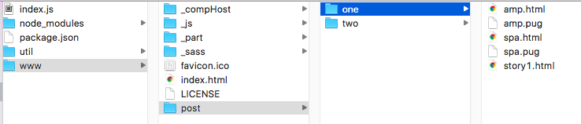
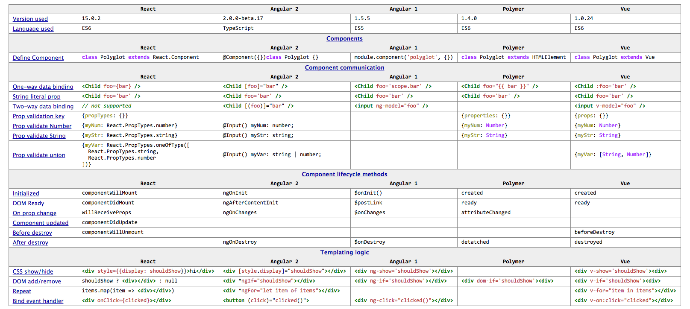

## LabD
# Foundation: DataBinding

### Goals
Just because databinding is basic skill, it does not make it easy somehow. You will practice front end data-binding 
a few different ways (browser, server, web component, etc). Pro-musicians and pro-basketball players practice, so should you. 
Ideally you know of Sass, Scss or LESS and have more that just a few years out of school, this is not suitable for 
people with only a few years experience out of school, you need some experience.

We do some foundation level things and then some more advanced level related to data binding. 

## I Databinding basics
### 0. Setup
- Download and run <http://github.com/topseed/topseed> as per instructions there. Also, 
that website has a link to a support form 'gitter'. Join there. If you have any questions or comments, 
you'll find support there from the instructors.
- Install  <http://tinyurl.com/mjeka4j> Advanced REST Client, a Chrome browser plugin for REST
- Required IDE: 
 <http://code.visualstudio.com> (so you can get instructor support). Set it to auto-save and use tabs, not spaces, don't be a savage ;-).
- Use Chrome browser. Click menu (:) on right/ More Tools/ Developer Tools. This will show you 'console' for: console.log('here'); in .js.
- Optional: Install prepros.io and add /topseed/webApp as project.
- Recommended: Install <https://zeit.co> and deploy /topseed/webApp. This way you start learning how to have a learning web site.

### 1a. MicroService, REST(y)
Using Advanced REST Client above, execute POSTs to these urls:
- https://middle4top-vgylwtpbxs.now.sh/membersPg/mem
- https://middle4top-vgylwtpbxs.now.sh/membersPg/list
Both should return some JSON data.

### 1b. Using fetch() for remote data calls
- In the browser with the Developer Tools open, go to https://1595566120.rsc.cdn77.org/_tsts/tst1.html>
- View page source (rightclick on content) and tst1.js.
This is an example of JavaScript 'fetch()' browser standard that replaces Ajax and XHR.
You can find the source at https://github.com/topseed/topseed-demos/tree/master/webApp/www/_tsts 

### 2a. Reading data from HTML form
In browser with the Developer Tools open, go to <https://1595566120.rsc.cdn77.org/members/authJoin/>
- Enter some data and click on NEW/JOIN button. See the form data logged in Developer Tools console.
- View page source and the JavaScript function init(). It uses jQuery jsForm to access the html form data.
(jQuery is loaded in /_js/setup.js) 

### 2b. Client-side binding of list data
With any a reasonably powerful browser (i.e. all except slow mobile devices) you can use JavaScript to dynamically
populate a list, and do further operations in the browser, possibly without going back to the server. That may help with 
a smoother, more desktop-like user experience.
- Go to <https://1595566120.rsc.cdn77.org/members/dBindDT/index0.html>
- View Developer Tools console. When you click on a line, you get a 'primary key' of the clicked row.
- View page source and the JavaScript function dtInit(). 
- Recommended: Read documentation at <http://datatables.net>. 

### 2c. Client-side binding of list data obtained from an API via fetch()
In the previous step, we saw list the list data in JSON format hardcoded in the page.
- Go to https://1595566120.rsc.cdn77.org/members/dBind/?w=1 
- View page source and look for JavaScript fetch().  
[TBD: need version without component, we're not there yet in this tutorial]

## II Intermediate databinding

### 1a Server-side binding of list data: the output
In certain situations (e.g. for basic/slower mobile devices) you will want to use as little JavaScript 
in the browser as possible. If you are able to avoid JavaScript at all the page may qualify as an "AMP" page 
which gets higher ranking for mobile searches (and free caching) by Google. To get there, you may need 
to bind your data server-side before sending it to the browser as an already complete page.
- Go to https://1595566120.rsc.cdn77.org/members/dBind/
- View page source and see the complete HTML and zero JavaScript.  
[TBD: clean up/reduce CSS]

### 1b Server-side binding of list data: the mechanism 
To obtain complete HTML in 1a we use JavaScript on the server (running on Node.js) to compose the page before 
returning it to the browser. Inspect the server-side code here:
- <https://github.com/topseed/topseed-demos/blob/master/webApp/route/membersAmp.js>
See ~ line 108 for a fetch(). We place the fetch results in the HTML response.  
[TBD: version without component, and move fetch code to the top of the JS as much as possible]

### 2 Deciding whether to return the client-side or server-side rendered version
In production, you can use subdomains to decide. E.g. when m.topseed.io is called, return the AMP "html only" version.
When www.topseed.io is called, return the "Web" version that contains JavaScript.
In development we don't use domains, so we use ?w=1 to simulate a call to the "Web" version.
- Optional: If you are curious how this "deciding" is done on the server, inspect
<https://github.com/topseed/topseed/blob/master/webApp/util/Decider.js>  See isW() function ~ line 48.

Node.js - which runs JavaScript on the server - allows us to use essentially the same code to obtain data 
from an API, either client- and server-side, depending on the request.

For Search Engine Optimization (SEO), you may aim to make at least the homepage AMP/HTML only. Links may lead
to rich "Web" pages that have JavaScript and more functionality.

### 3 File Layout

[TBD: explain layout]

### 4 Authentication
- Using Advanced REST Client, try: 
- https://middle4top-vgylwtpbxs.now.sh/membersPg/join
with 'body' of message as 
{
	"userEmail": "vicmasons@gmail.com"
	,"password": "123"
}
and custom Content-Type: application/json

This will return a JSON Web Token, or an error message if the password is not '123'.

## III Advanced

### 1 Web Component
There are many component libs, and you may need to 'polyglot', ie know more than one, since they change every 18 months or so.

We will use the easiest one to learn: <http://riotjs.com>

Check out SPA again, notice it is using a component:
- <https://1595566120.rsc.cdn77.org/members/dBind/?w=1>

- Optional: Review slides https://1595566120.rsc.cdn77.org/slidesDBind/

# Lab:Hands on DataBinding component`

- <https://github.com/topseed/topseed/tree/master/webApp/www/members/LABD>
The lab is in the topseed that you downloaded.
The component used on page is missing DOM mark up.
Implement it to make it works. (Solution is in -demo, if you just want to cut paste from a working component: just the DOM)

### Notice that a page action loads the page. The page then fetches the data and loads the component. The data comes from page, and gets stored in component('s DOM). The component then can notify the page of something page may need to listen to - in an loosely coupled way (via events). So it flows from page to comp, and then it may bubble back up from comp to page. Also the (UI) component should be reusable, independent, and encapsulated. 

#### That is it for the data binding, now on to some more important front end skills. 
