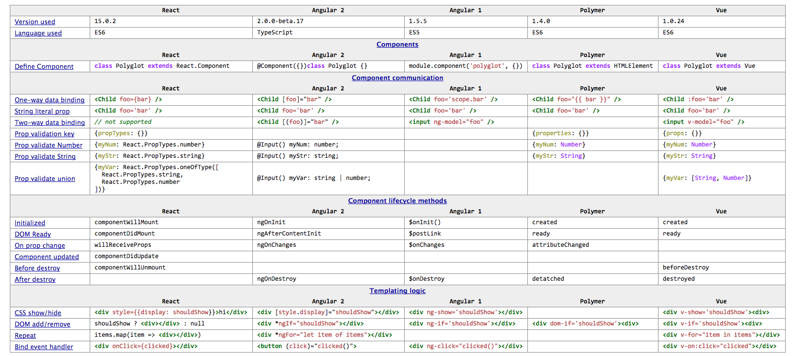

## LabD
#  DataBinding

## DataBinding III 

### Web Component
There are many component libs, and you may need to 'polyglot', ie know more than one, since they change every 18 months or so.

We will use the easiest one to learn: <http://riotjs.com>

Check out this SPA, notice it is using a component:
- <https://1595566120.rsc.cdn77.org/members/dBind/spa2.html?w=1>

- Optional: Review slides https://1595566120.rsc.cdn77.org/slidesDBind/

# Lab: Hands on DataBinding component

- <https://github.com/topseed/topseed/tree/master/webApp/www/members/LABD>
The lab is in the topseed that you downloaded.
The component used on page is missing DOM mark up.
Implement it to make it works. (Solution is in -demo, if you just want to cut paste from a working component: just the DOM)

#### Notice that a page action loads the page. The page then fetches the data and loads the component. The data comes from page, and gets stored in component('s DOM). The component then can notify the page of something page may need to listen to - in an loosely coupled way (via events). So it flows from page to comp, and then it may bubble back up from comp to page. Also the (UI) component should be reusable, independent, and encapsulated. 

Also:
- 'fetch' from page, never from comp
- get databinding to work in page, w/o component first
- ui components are optional (designers should do ui)
- sometimes you don't need both server side and in-browser
- avoid HTML in js
- test in build.phonegap 
- check SEO. Webmaster tools has view as bot

That is it for the data binding, now on to some more important front end skills. 
